# Real-Time Market Surveillance & Risk Controls

>An automated monitoring-and-intervention system built around a live trading bot in Polymarket's 5-minute crypto prediction markets, run for about three months (small fixed stakes, $5 per trade in the final config, with paper-trading used to stage changes first).
>
>The trading logic was the environment. What this repo is really about is the **detection, intervention, and validation** layers around it: spotting spoofing in the order book and locking out activity when it fires, monitoring large wallets, and testing whether my own risk model was actually earning its keep.

**Status:** archived portfolio project · not intended for live use · credentials and data removed · ~9,900 lines of Python (the order-signing service is intentionally left out — see [Execution layer](#execution-layer-design-only))

**Provenance:** built independently, on my own account and own capital, with no employer or client data involved. Wallet monitoring here uses only Polymarket's public activity API for pseudonymous on-chain addresses — no private or identifying data.

**Stack:** Python (asyncio, aiohttp, websockets) · XGBoost, scikit-learn, SHAP · pandas, matplotlib · Streamlit · Binance public WebSocket streams · Polymarket Gamma / CLOB / Data APIs

---

## Highlights

- **Real-time spoofing detection with automatic intervention.** Watches the order book for large orders that appear near the price, rest briefly, and vanish — then checks whether price moves afterward. Cancellations with no follow-through are treated as likely genuine, to keep false positives down. When a spoof is flagged, trading locks out automatically.
- **Entity-level monitoring of large actors.** Tracks a set of large wallets' public activity and pauses trading when they cluster activity (2+ trades or $500+ within 3 minutes). Separate tools profile a wallet's behavior — price levels, position sizing, timing, market selection — to establish what "normal" looks like for it.
- **Automated controls with defined triggers and effects.** Four controls that act on their own rather than logging a warning and waiting for a human: spoof lockout, whale-activity pause, daily loss limit, and a per-asset rolling win-rate throttle.
- **Alert-effectiveness testing.** Every trade the ML filter blocked is tracked to its real outcome, so blocked winners (false positives) can be weighed against blocked losers (true positives) — instead of assuming the filter works because it sounds reasonable.
- **Thresholds tuned on evidence.** An analysis of **11,608 trades** drove concrete changes: two assets at coin-flip accuracy were dropped, an entry floor was added after sub-0.40 entries won only 28.5% (193 trades), and a weaker signal path was demoted to last resort.
- **Independent verification and an audit trail.** Every logged trade is re-verified against Polymarket's resolved-market data, logs are de-duplicated by token ID, and a separate measurement process records market data straight from exchange streams — independent of the bot's own code.
- **A headline metric that hid the real risk.** The strategy won roughly 83–89% of the time, and this repo documents why that number is misleading. [Details below.](#the-finding-a-headline-metric-that-hid-the-real-risk)

## Surveillance concepts, mapped to the code

| Concept | Where |
|---|---|
| Real-time anomaly detection (spoofing pattern) | `Isolated signal concepts/spoof_detector.py` (prototype), live gate in `Core trading system/unified_bot.py` |
| Automated intervention on an alert | Spoof lockout, whale pause, daily loss limit, win-rate throttle |
| Large-actor / entity monitoring | `Distinct Strategies/whale_watching_bot.py`, `Wallet Behavior Profiling/monitor_wallet_live.py` |
| Behavioral baselining of an entity | `Wallet Behavior Profiling/profile_wallet.py` |
| Alert-threshold tuning from data | The 11,608-trade analysis; changelog at the top of `unified_bot.py` |
| Alert-effectiveness review (false vs true positives) | `Core trading system/ml_shadow_log.py` |
| Risk-model validation (out-of-sample, explainable) | `Core trading system/trade_ml_pipeline.py` |
| Reconciliation against a source of truth | `Analysis-results-diagnostics/check_results.py`, `merge_logs.py` |
| Independent monitoring / measurement | `Analysis-results-diagnostics/momentum_tracker.py` |
| Monitoring dashboard | `Analysis-results-diagnostics/dashboard.py` (Streamlit) |

*Quickest skims:* `spoof_detector.py` (173 lines), `ml_shadow_log.py` (229 lines), and the changelog at the top of `unified_bot.py`.

## Architecture

```mermaid
flowchart LR
    subgraph Feeds
        B["Binance streams: trades and order book"]
        P["Polymarket APIs: markets, CLOB book, wallet activity"]
    end
    subgraph Detection["Detection and signals"]
        SP["Spoofing detector"]
        WH["Large-wallet monitor"]
        SG["Trade signals: sweep, flow, price, path resistance"]
    end
    subgraph Controls["Automated controls"]
        G1["Spoof lockout"]
        G2["Whale pause"]
        G3["Daily loss limit"]
        G4["Rolling win-rate throttle"]
        G5["ML risk filter"]
    end
    E["Order-signing service - code intentionally omitted"]
    L["Trade log"]
    A["Audit: verify vs resolved markets, momentum tracker, shadow log, dashboard"]
    Feeds --> Detection --> Controls --> E --> L --> A
```

---

# Details

## Detection and intervention

### Spoofing
`spoof_detector.py` watches the live order book for large orders placed near the current price, tracks how long they rest, and flags the pattern when one is cancelled and price then moves. In the standalone prototype the parameters are orders of 1.7–9.7 BTC within $15 of price, resting 5–150 seconds, followed by a $4+ move; a cancellation with no follow-through is logged as likely genuine rather than flagged. On a flag, trading is locked out for a short window (30 seconds in the live bots).

The pattern came from watching order books by eye: large orders that appear near the price, sit briefly, and vanish shortly before a window closes, followed by a move. The prototype runs two WebSocket streams (price and order book); the version inside the live bots is a tighter rewrite against a single order-book stream.

### Large-wallet monitoring
`whale_watching_bot.py` tracks a set of large wallets' public trade activity. When a tracked wallet places two or more trades, or moves $500+, within a 3-minute window, trading pauses until the tracked wallets have been quiet for 5 minutes. The spoof lockout and whale pause are checked together as a single combined gate, so a trade fires only when neither is active.

`Wallet Behavior Profiling/` builds behavioral profiles of wallets from Polymarket's public activity API — what prices they buy at, how they size, when they act, which markets they pick. `monitor_wallet_live.py` polls a tracked wallet in real time. Knowing what normal looks like for an entity is what makes a deviation detectable, which is the same idea behind counterparty and entity due diligence.

### Automated controls

| Control | Trigger | Effect |
|---|---|---|
| **Spoof lockout** | Large near-price order cancelled, followed by a price move | Trading locked out (30 s in the live bot) |
| **Whale-activity pause** | A tracked wallet places 2+ trades, or moves $500+, within 3 minutes | Paused until tracked wallets are quiet for 5 minutes |
| **Daily loss limit** | Cumulative loss for the day reaches $40 | Bot halts (the counter lives in memory, so resuming takes a deliberate restart) |
| **Rolling win-rate throttle** | An asset's last 10 resolved trades fall below a 65% win rate | Stops new signal trades on that asset only; other assets and sweep trades unaffected |

Position-level limits sit alongside these: a fixed per-trade size and a cap on concurrent open positions (set generously, 500, in the live config — the daily loss limit was the tighter constraint in practice).

**A fifth control that was tried and deliberately removed.** The ML pipeline's `TradeFilter` class has a `cycle_loss_streak()` method, commented in the code as a circuit breaker: after 3 consecutive losing cycles, pause trading for 20 minutes. It was wired into the live bot, tested, and then taken back out — the behavior it produced wasn't an improvement in practice, so it got removed rather than kept for the sake of having built it.

## The finding: a headline metric that hid the real risk

The strategy's raw win rate looked strong — roughly 83–89% across thousands of trades. That number is misleading on its own, and understanding why matters more than the number itself.

These 5-minute markets price a contract between 0 and 99¢ as the market's live implied probability of the outcome. By the time a contract trades at 95¢+, price action earlier in the window has already made one side look near-certain. The strategy waited for that near-certain state and bought the last few cents of implied edge — which is why it won most of the time. It wasn't predicting anything; it was reading an outcome the market had mostly already decided.

The losses came from the part that isn't locked in until the window actually closes: a genuine late reversal, or a spoofed order-book signal manufacturing a false "already decided" read. Payouts followed the same shape — a win returned a few cents on the dollar, a loss cost the full stake — so a short streak of losses outside the normal range could erase dozens of wins.

**A high win rate coexisting with a fragile, high-risk-of-ruin position is the actual finding**, and it's why the automated controls above mattered as much as they did.

## Alert effectiveness and model validation

**`trade_ml_pipeline.py`** — an XGBoost classifier that scores each candidate trade and blocks those below a calibrated probability threshold. It's validated walk-forward across 5 folds rather than a single train/test split, reporting AUC and average precision per fold, and compares the win rate of all trades against only the trades the filter would have kept, so the filter has to beat the unfiltered baseline out-of-sample. Entry price and features derived from it dominate feature importance, with recent per-asset win rate a distant second tier — legible, checkable drivers rather than an opaque score. Overall AUC was modest (≈ 0.68), and the README treats it that way.

**`ml_shadow_log.py`** — every trade the filter blocked is logged and resolved against the real outcome once the market settles, whether or not the trade was ever placed. Blocked losers are money saved (true positives); blocked winners are money missed (false positives). The log reports both, per asset and per signal type, plus a running verdict on whether the filter is net-helping or net-hurting.

The ML filter only ran for about three weeks of the three-month period, so these diagnostics matter more as a demonstration of the validation approach than as a claim about a fully proven model.

## Independent verification and audit trail

- **`check_results.py`** re-verifies every logged trade against Polymarket's resolved-market data and produces the ledger the ML pipeline trains on.
- **`merge_logs.py`** de-duplicates trade logs by token ID so no trade is counted twice.
- **`momentum_tracker.py`** runs as a separate process alongside the bot and changes nothing about it. It records order-flow and price-move data for every 5-minute window directly from public exchange streams, independent of the bot's signal logic — keeping the measurement tool separate from the system being measured was deliberate.
- **`analyze_bot_trades.py`** joins each losing trade to the tracker's momentum data and tags a likely reason (for example, buying into opposing order flow).
- **`dashboard.py`** is a Streamlit monitoring terminal over the same results.

## Threshold tuning: what the data changed

An analysis of 11,608 trades drove a concrete round of changes to the live system, each tied to a specific number:

- BTC/ETH/XRP/SOL clearly outperformed BNB and DOGE (49.6% and 53.1% win rates — coin flips), which were dropped.
- Entries below a 0.40 price had a 28.5% win rate over 193 trades (138 losses), so a hard entry floor was added (set at 0.45).
- Repriced signals ran 75.4% versus 88.9% for normal ones, so repricing was tightened to a last-resort path.

## How the trade signals worked

The entry signals were designed by hand, each starting as a pattern noticed by watching live markets and then checked against the logged results. Standalone prototypes are in `Isolated signal concepts/`; `unified_bot.py` is where they were combined.

- **Liquidity sweep** (`orderbook_watcher.py`) — a large block of resting sell orders at 99¢ disappears all at once late in a window (3,000 shares for BTC, 800 for smaller assets in the live bot). A sweep on both sides of the same market at once is discarded as market-maker rebalancing.
- **Order-flow imbalance** (`flow_signal.py`) — buy versus sell volume over a rolling window, graded by whether price movement confirms it, with a minimum volume per asset. The standalone version also flags volume exhaustion followed by a confirmed reversal.
- **Price versus window open** — how far price has moved since the window opened, weighted by how much of the window has elapsed, so the same move counts for more near the close than near the start.
- **Path resistance** — exchange order-book depth between the current price and the window-open price: whether resting bids support the move needed to finish in the money, or an ask wall stands in the way.

The sweep is the trigger; the other signals add to a score and can veto the trade when they strongly conflict, and the controls and ML filter above are applied on top before anything is placed.

## Wallet-pattern reuse and abandoned experiments

The wallet-profiling technique shows up a second time in `Distinct Strategies/weather_copier.py`, pointed at a different market: it reconstructs a specific wallet's weather-market pattern (price range, bucket width, days ahead of resolution) from cached trade history and trades that pattern (simulation mode by default in this archived config). One technique, reused across two unrelated market types.

`weather_trader.py` and `arbbot.py` were tested and abandoned. The weather bot auto-discovers temperature markets and blends a forecast API with live station readings, but it needed tuning time that didn't get spent, so it was dropped rather than half-finished. The arbitrage scanner rarely found a price gap across paired markets that survived fees. Left in as a record of what was tried, not as evidence either one worked.

## Execution layer (design only)

Strategy logic and order execution were separate processes by design. The Python bot launched a small Node.js service as a child process, waited for it to report ready, then sent it trade decisions over localhost. That service was the only component that signed and submitted orders — the bot process only read market data and sent a keep-alive heartbeat — and it was bound to localhost and guarded by a shared-secret header, keeping order signing isolated from strategy logic.

**I deliberately left the execution code out of this repo** so that nothing here can be used to place orders, in case it were misused. The bots' order calls simply have nothing to talk to. `whale_watching_bot.py` predates the split and is included for its gating logic rather than as a working execution path.

## Limitations

- The detection rules are hand-built heuristics from observing the order book. There was no labeled dataset of spoofing, and the spoof rule's precision and false-positive rate were not formally measured in this repo.
- The system does detection and automated intervention only — there's no alert queue, case management, or reporting layer; the response to a flag is an automatic lockout.
- Wallet monitoring is threshold-based on public activity from pseudonymous addresses.
- Single venue and asset class, and the ML filter ran for about three weeks, so the evidence on it is limited.

---

## Layout

| Folder | Contents |
|---|---|
| `Core trading system/` | Main bot, ML risk filter, shadow-testing log |
| `Isolated signal concepts/` | Standalone prototypes: spoof detection, order-flow imbalance, liquidity-sweep detection |
| `Analysis-results-diagnostics/` | Trade verification, momentum tracking, loss analysis, monitoring dashboard |
| `Distinct Strategies/` | Whale-activity gate, wallet-pattern experiment for weather markets, two abandoned experiments |
| `Wallet Behavior Profiling/` | Wallet-level activity profiling and live monitoring |

The order-signing service is intentionally not included — see [Execution layer](#execution-layer-design-only).

**How the analysis tools connect:** the bot writes `trades_log.txt`; `check_results.py` verifies each trade against Polymarket and writes a results cache and `trades_analysis.xlsx`; `trade_ml_pipeline.py` trains and validates on that ledger. Separately, `momentum_tracker.py` writes `momentum_data.csv`, which `analyze_bot_trades.py` joins to the losing trades.

Config and credentials are not included.

## Disclaimer

Archival and educational. Not financial advice. Trading involves risk of loss, and — see above — a high win rate does not mean low risk.

No license is granted. This repository is shared for review purposes only (e.g. recruiting/portfolio evaluation) and is not licensed for reuse, modification, or redistribution.
